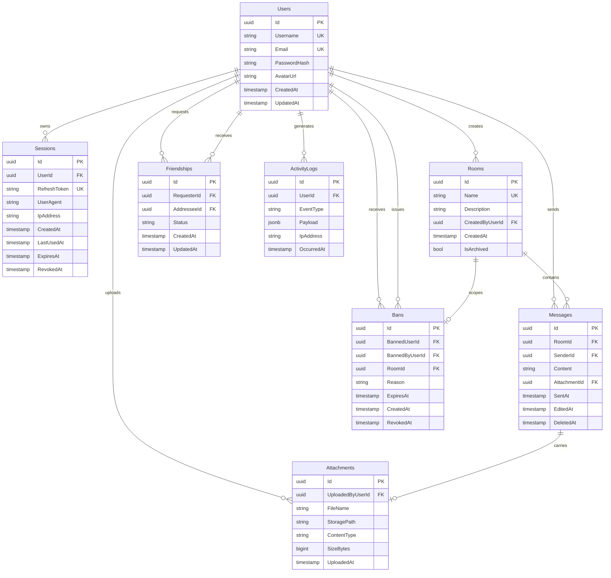

# AI Chat Herder — Architecture Design

**Date:** 2026-04-18
**Status:** Approved

---

## Table of Contents

1. [Overview](#1-overview)
2. [Tech Stack](#2-tech-stack)
3. [System Design — Clean Architecture](#3-system-design--clean-architecture)
4. [Security — Auth, Sessions & Ban Enforcement](#4-security--auth-sessions--ban-enforcement)
5. [Presence Engine](#5-presence-engine)
6. [Database Schema](#6-database-schema)
7. [Real-time Protocol — SignalR Hubs](#7-real-time-protocol--signalr-hubs)
8. [Message Queue — RabbitMQ](#8-message-queue--rabbitmq)
9. [File Storage](#9-file-storage)
10. [Frontend — Angular 21](#10-frontend--angular-21)
11. [Infrastructure — Docker Compose](#11-infrastructure--docker-compose)

---

## 1. Overview

AI Chat Herder is a real-time online chat server supporting public rooms, multi-tab presence tracking, file attachments, session management, and activity logging. The system is designed for horizontal scaling from day one: multiple API replicas share state exclusively through Redis and PostgreSQL, with no in-process shared memory.

**Core constraints:**
- Public rooms only (DMs and private rooms are schema-stubbed for future expansion)
- Maximum file attachment size: 20 MB
- AFK threshold: 60 seconds without a heartbeat
- Session granularity: one session per browser tab group; multiple concurrent sessions supported and independently revocable
- Bans take effect immediately, within milliseconds of issuance

---

## 2. Tech Stack

| Layer | Technology |
|-------|-----------|
| Backend API | .NET 10 Web API — Minimal APIs |
| Real-time | ASP.NET Core SignalR |
| ORM | Entity Framework Core 10 + Npgsql |
| Database | PostgreSQL 17 |
| Cache / Presence | Redis 7 |
| Message Broker | RabbitMQ 3.13 |
| Frontend | Angular 21 (Signals, Standalone Components, Control Flow) |
| Containerisation | Docker & Docker Compose |

---

## 3. System Design — Clean Architecture

### Layer Boundaries

```
ai-chat-herder/
├── src/
│   ├── ChatHerder.Domain/           # Entities, Value Objects, Domain Events, Interfaces
│   ├── ChatHerder.Application/      # Use Cases, DTOs, port interfaces
│   ├── ChatHerder.Infrastructure/   # EF Core, Redis, RabbitMQ, LocalFileStorage
│   └── ChatHerder.API/              # Minimal API endpoints, SignalR Hubs, DI wiring
└── frontend/                        # Angular 21 standalone app
```

**Dependency rule (inward only):**
- `Domain` has zero external dependencies — pure C# entities and domain interfaces.
- `Application` depends only on `Domain` — no EF, no Redis, no SignalR, no RabbitMQ.
- `Infrastructure` implements all port interfaces from `Application` using concrete adapters.
- `API` wires DI, hosts Minimal API routes and SignalR hubs, calls `Application` services.

### Application Port Interfaces

Defined in `ChatHerder.Application`, implemented in `ChatHerder.Infrastructure`:

```
IFileStorage        → LocalFileStorage (MVP) / S3FileStorage (future)
IMessageBus         → RabbitMqMessageBus
IActivityLogger     → publishes ActivityEvent to RabbitMQ
IPresenceStore      → RedisPresenceStore
ISessionStore       → RedisSessionStore + EF Session persistence
IBanStore           → RedisBanStore + EF Bans persistence
```

### API Layer — Minimal API Structure

```
ChatHerder.API/
├── Program.cs                          # Builder + app pipeline wiring only
├── Endpoints/
│   ├── AuthEndpoints.cs                # POST /auth/login, /auth/refresh, /auth/logout
│   ├── RoomEndpoints.cs                # GET/POST /rooms, GET /rooms/{id}/messages
│   ├── SessionEndpoints.cs             # GET /sessions, DELETE /sessions/{id}, DELETE /sessions/current
│   └── FileEndpoints.cs                # POST /files/upload, GET /files/{id}
├── Hubs/
│   ├── ChatHub.cs
│   └── PresenceHub.cs
└── Middleware/
    ├── BanCheckMiddleware.cs           # Runs first — Redis ban gate
    └── SessionValidationMiddleware.cs  # Validates session_id claim against Redis
```

Each `*Endpoints.cs` is a static class with a single `Map(RouteGroupBuilder group)` method. `Program.cs` composes them:

```csharp
app.MapGroup("/api")
   .MapAuth()
   .MapRooms()
   .MapSessions()
   .MapFiles();
```

### Middleware Pipeline Order

```
JWT Bearer Authentication    ← UseAuthentication() — validates token, populates HttpContext.User
BanCheckMiddleware           ← reads userId claim from User, checks ban:{userId} in Redis → 403
SessionValidationMiddleware  ← reads session_id claim, checks sessions:valid:{userId} in Redis → 401
Authorization                ← UseAuthorization() — policy-based checks
Endpoints / Hubs             ← business logic
```

`BanCheckMiddleware` and `SessionValidationMiddleware` both depend on `HttpContext.User` being populated, so they must run after `UseAuthentication()`. Unauthenticated requests (missing/invalid JWT) are rejected by `UseAuthentication()` before either middleware is reached.

---

## 4. Security — Auth, Sessions & Ban Enforcement

### JWT Strategy

- **Access token:** short-lived (15 minutes), carries `user_id`, `session_id`, `jti` claims.
- **Refresh token:** opaque, 7-day TTL, stored as a column on the `Sessions` row in PostgreSQL.
- JWT is passed as `?access_token=` query string on SignalR WebSocket connections (browser WebSocket API limitation).

### Session Materialisation

Each login creates a `Sessions` row recording `UserAgent`, `IpAddress`, `CreatedAt`, `ExpiresAt`. Active session IDs are cached in Redis:

```
sessions:valid:{userId}  →  Set<sessionId>
```

`SessionValidationMiddleware` checks `SISMEMBER sessions:valid:{userId} {session_id}` on every request. Revocation removes the session ID from the set instantly — no wait for token expiry.

On session revoke, all SignalR connections associated with that session are force-disconnected via:
```
IHubContext<PresenceHub>.Clients.Clients(connectionIds)
    .SendAsync("ForceDisconnect", "session_revoked")
```
Connection IDs for the session are retrieved from `presence:session:{connectionId}` Redis keys scanned by session ID.

### Immediate Ban Enforcement

Pure stateless JWT cannot enforce bans within the access token lifetime. The solution is a **Redis ban gate**:

```
ban:{userId}  →  "1"   TTL = ban duration (no TTL for permanent bans)
```

`BanCheckMiddleware` (first in pipeline) checks this key before any session or JWT logic runs. If present, the request is rejected with `403 Forbidden`.

**When a ban is issued, four operations execute:**

1. Write `Bans` row to PostgreSQL.
2. `SET ban:{userId} 1 EX {durationSeconds}` in Redis.
3. Revoke all active sessions: `DEL sessions:valid:{userId}`.
4. Force-disconnect all SignalR connections: read `presence:tabs:{userId}` Sorted Set members, call `ForceDisconnect` on each `connectionId`.

**Temporary ban expiry** is handled automatically by Redis TTL — no background job required. Manual early un-bans: `DEL ban:{userId}` + set `Bans.RevokedAt`.

---

## 5. Presence Engine

### Redis Data Structures

```
# Global set of connected userIds (for PresenceMonitorService enumeration)
active:users                    Set        members=userId[]

# Per-user tab registry
presence:tabs:{userId}          SortedSet  member="{connectionId}:{tabId}"  score=Unix timestamp (last heartbeat)

# Reverse lookup for disconnect cleanup
presence:conn:{connectionId}    String     value=userId    TTL=70s

# Derived status (rebuilt on every tab change)
presence:status:{userId}        String     value="online"|"afk"|"offline"   TTL=90s

# connectionId → sessionId (for session-revoke forced disconnect)
presence:session:{connectionId} String     value=sessionId    TTL=70s

# Room membership
room:members:{roomId}           Set        members=userId[]
```

`active:users` is maintained by `OnConnectedAsync` (`SADD`) and `OnDisconnectedAsync` (`SREM` when tab count reaches zero). The `PresenceMonitorService` calls `SMEMBERS active:users` once per poll cycle to get the enumerable set — avoiding a `SCAN` over all Redis keys.

### Tab Lifecycle

**OnConnectedAsync (PresenceHub):**
1. Extract `userId` + `sessionId` from JWT claims; generate `tabId = Guid.NewGuid()`.
2. `ZADD presence:tabs:{userId} {now} "{connectionId}:{tabId}"`.
3. `SET presence:conn:{connectionId} {userId} EX 70`.
4. `SET presence:session:{connectionId} {sessionId} EX 70`.
5. Recompute `presence:status:{userId}` → `"online"`.
6. Broadcast `UserStatusChanged` to all rooms the user currently occupies.

**OnDisconnectedAsync (PresenceHub):**
1. `GET presence:conn:{connectionId}` → `userId`.
2. `ZREM presence:tabs:{userId} "{connectionId}:{tabId}"`.
3. `DEL presence:conn:{connectionId}`.
4. If `ZCARD presence:tabs:{userId} == 0` → set status `"offline"`, broadcast.
5. `SREM room:members:{roomId} userId` for each joined room.

### Heartbeat Mechanism

The Angular client sends `Heartbeat()` to `PresenceHub` every **30 seconds** from each active tab (2× safety margin before the 60s AFK threshold).

**Server-side handler:**
1. `ZADD presence:tabs:{userId} {now} "{connectionId}:{tabId}"` (update score).
2. `SET presence:conn:{connectionId} {userId} EX 70` (refresh TTL).
3. If current status is `"afk"` → recompute to `"online"`, broadcast `UserStatusChanged`.

### AFK Detection — `PresenceMonitorService`

`IHostedService` polling every **20 seconds**:

```
afk_threshold = now − 60s

for each userId with active presence:status key:
    stale = ZRANGEBYSCORE presence:tabs:{userId} 0 {afk_threshold}
    live  = ZRANGEBYSCORE presence:tabs:{userId} {afk_threshold} +inf

    if ZCARD(presence:tabs:{userId}) > 0 AND count(live) == 0:
        SET presence:status:{userId} "afk"
        broadcast UserStatusChanged(userId, "afk")
```

Complexity is O(stale connections), not O(all connections) — `ZRANGEBYSCORE` filters at the data structure level.

The 70-second TTL on `presence:conn:*` keys acts as a self-healing backstop: if the monitor crashes, ghost-online users expire automatically within 70 seconds.

---

## 6. Database Schema



### Indexes

```sql
-- Hot read path: paginated room history (partial — excludes soft-deleted rows)
CREATE INDEX idx_messages_room_sent
    ON Messages (RoomId, SentAt DESC)
    WHERE DeletedAt IS NULL;

-- Session management: list active sessions per user
CREATE INDEX idx_sessions_user_active
    ON Sessions (UserId, ExpiresAt)
    WHERE RevokedAt IS NULL;

-- Refresh token lookup (single-row, must be O(1))
CREATE UNIQUE INDEX idx_sessions_refresh ON Sessions (RefreshToken);

-- Activity log: user history and event-type filtering
CREATE INDEX idx_activity_user_time  ON ActivityLogs (UserId, OccurredAt DESC);
CREATE INDEX idx_activity_event_time ON ActivityLogs (EventType, OccurredAt DESC);

-- Ban check on every connect and message send
CREATE INDEX idx_bans_user_expiry ON Bans (BannedUserId, ExpiresAt);
```

---

## 7. Real-time Protocol — SignalR Hubs

### Connection

```
/hubs/presence   →  PresenceHub   RequireAuthorization()
/hubs/chat       →  ChatHub       RequireAuthorization()
```

JWT is passed as `?access_token=` query string — the only mechanism available for browser WebSocket upgrades. Angular's `SignalRService` manages both connections, refreshes the access token before reconnect, and applies exponential backoff with jitter.

---

### PresenceHub — `/hubs/presence`

**Client → Server:**

| Method | Parameters | Description |
|--------|-----------|-------------|
| `Heartbeat` | — | Updates tab timestamp in Redis Sorted Set every 30s |
| `JoinRoom` | `roomId: string` | Adds user to SignalR group + `room:members:{roomId}` Redis Set; server broadcasts `RoomMembersSnapshot` |
| `LeaveRoom` | `roomId: string` | Removes from group + Redis Set |

**Server → Client:**

| Method | Payload | Description |
|--------|---------|-------------|
| `UserStatusChanged` | `{ userId, status }` | `"online"` \| `"afk"` \| `"offline"` |
| `RoomMembersSnapshot` | `{ roomId, members[] }` | Full member list snapshot on room join |
| `ForceDisconnect` | `{ reason }` | Session revoked or ban issued; client clears auth state and redirects to `/login` |

---

### ChatHub — `/hubs/chat`

**Client → Server:**

| Method | Parameters | Description |
|--------|-----------|-------------|
| `SendMessage` | `roomId, content, attachmentId?` | Validates ban + room membership; persists; broadcasts; publishes `message.sent` to RabbitMQ |
| `EditMessage` | `messageId, newContent` | Own messages only; server enforces ownership |
| `DeleteMessage` | `messageId` | Soft delete — sets `DeletedAt`; own messages only |
| `StartTyping` | `roomId` | Ephemeral — never persisted, never queued |
| `StopTyping` | `roomId` | Ephemeral |

**Server → Client:**

| Method | Payload | Description |
|--------|---------|-------------|
| `MessageReceived` | `MessageDto` | New message; fan-out via Redis SignalR backplane across replicas |
| `MessageEdited` | `MessageDto` | Edited message |
| `MessageDeleted` | `{ messageId, roomId }` | Soft-deleted message |
| `UserTyping` | `{ roomId, userId, isTyping }` | Typing indicator |

### Cross-Replica Message Flow

```
Client Tab A → Replica 1
  ChatHub.SendMessage()
    → Application.SendMessageUseCase
        → EF Core → PostgreSQL           (persist)
        → Groups.All(roomId).SendAsync() (Redis backplane fans out to all replicas)
        → RabbitMQ publish "message.sent" (ActivityConsumer logs async)

Client Tab B → Replica 2
  ← receives MessageReceived via backplane
```

Typing indicators bypass RabbitMQ entirely — they are ephemeral, have no audit value, and the Redis backplane delivers them cross-replica for free.

---

## 8. Message Queue — RabbitMQ

### Topology

```
Exchange: chat.events   (topic, durable)

Routing keys published by the API:
  message.sent
  message.edited
  message.deleted
  user.connected
  user.disconnected
  user.joined_room
  user.left_room
  user.banned
  session.revoked

Queue: activity.log     binding: chat.events.#
  Consumer: ActivityConsumer (IHostedService in Infrastructure)
  → Deserialises ActivityEvent
  → INSERT ActivityLogs row via EF Core
```

### ActivityEvent Shape

```csharp
record ActivityEvent(
    Guid      UserId,
    string    EventType,
    JsonNode  Payload,
    string?   IpAddress,
    DateTime  OccurredAt
);
```

`Payload` is event-specific JSON — `message.sent` includes `roomId` + `messageId`; `user.banned` includes `bannedByUserId` + `reason` + `expiresAt`.

---

## 9. File Storage

### Interface

```csharp
public interface IFileStorage
{
    Task<StoredFile> SaveAsync(Stream content, string fileName, string contentType, CancellationToken ct);
    Task<Stream>     ReadAsync(string storagePath, CancellationToken ct);
    Task             DeleteAsync(string storagePath, CancellationToken ct);
}
```

`LocalFileStorage` (MVP) reads the base path from `IConfiguration["Storage:BasePath"]` (Docker volume mount). A future `S3FileStorage` swaps the implementation with no changes to Application or Domain layers.

### Local Filesystem Layout

```
/app/uploads/
└── {year}/
    └── {month}/
        └── {userId}/
            └── {attachmentId}_{originalFileName}
```

`Attachments.StoragePath` stores the relative path from `/app/uploads/`.

### Upload Flow

```
POST /api/files/upload
  → BanCheckMiddleware
  → SessionValidationMiddleware
  → 413 if Content-Length > 20 MB
  → IFileStorage.SaveAsync()
  → INSERT Attachments row (UploadedByUserId = current user)
  → return { attachmentId, fileName, contentType, sizeBytes }
```

The returned `attachmentId` is passed to `ChatHub.SendMessage()`. Upload and send are decoupled — the file exists before the message is created. `OrphanCleanupService` (IHostedService, runs nightly) deletes `Attachments` rows with no linked `Message` older than 24 hours and calls `IFileStorage.DeleteAsync()`.

### Download Flow

```
GET /api/files/{attachmentId}
  → BanCheckMiddleware
  → SessionValidationMiddleware
  → Load Attachments row by Id → 404 if absent
  → Verify linked Message exists and is not soft-deleted
  → IFileStorage.ReadAsync() → stream response with Content-Type header
```

Files are **never served from a static path**. All access goes through the API endpoint to enforce authorisation on every request.

---

## 10. Frontend — Angular 21

### Architecture

```
frontend/
├── app/
│   ├── core/
│   │   ├── auth/           # AuthService (JWT store via Signals), AuthInterceptor
│   │   ├── signalr/        # SignalRService (manages ChatHub + PresenceHub connections)
│   │   └── guards/         # authGuard (functional)
│   ├── features/
│   │   ├── rooms/          # RoomListComponent, RoomViewComponent (standalone)
│   │   ├── chat/           # MessageListComponent, MessageInputComponent
│   │   ├── presence/       # PresenceBadgeComponent, RoomMembersComponent
│   │   ├── sessions/       # SessionsComponent (active session list + revoke)
│   │   └── files/          # FileUploadComponent, FilePreviewComponent
│   └── app.routes.ts       # Standalone route config with lazy-loaded feature routes
```

### Key Patterns

- **Signals throughout:** `AuthService` exposes `currentUser = signal<User | null>(null)`. `PresenceService` exposes `roomMembers = signal<Map<string, UserPresence[]>>(new Map())`.
- **Control Flow:** `@if`, `@for`, `@switch` replace `*ngIf`/`*ngFor` directives in all templates.
- **SignalRService** manages both hub connections, handles token refresh before reconnect, and applies exponential backoff with jitter (base 1s, cap 30s).
- **SessionsComponent:** reads `session_id` claim from the decoded access token to mark the current session in the list. Each row has a standalone "Log out" button that calls `DELETE /api/sessions/{id}` and listens for `ForceDisconnect` to redirect if the current session was revoked from another device.

---

## 11. Infrastructure — Docker Compose

```yaml
services:

  postgres:
    image: postgres:17-alpine
    environment:
      POSTGRES_DB: chatherder
      POSTGRES_USER: chatherder
      POSTGRES_PASSWORD: ${POSTGRES_PASSWORD}
    volumes:
      - postgres_data:/var/lib/postgresql/data
    healthcheck:
      test: ["CMD-SHELL", "pg_isready -U chatherder"]
      interval: 5s
      retries: 5

  redis:
    image: redis:7-alpine
    command: redis-server --appendonly yes
    volumes:
      - redis_data:/data

  rabbitmq:
    image: rabbitmq:3.13-management-alpine
    environment:
      RABBITMQ_DEFAULT_USER: chatherder
      RABBITMQ_DEFAULT_PASS: ${RABBITMQ_PASSWORD}
    ports:
      - "15672:15672"   # Management UI (dev only)
    volumes:
      - rabbitmq_data:/var/lib/rabbitmq
    healthcheck:
      test: ["CMD", "rabbitmq-diagnostics", "ping"]
      interval: 10s
      retries: 5

  api:
    build:
      context: ./src
      dockerfile: ChatHerder.API/Dockerfile
    environment:
      ConnectionStrings__Default: "Host=postgres;Database=chatherder;Username=chatherder;Password=${POSTGRES_PASSWORD}"
      Redis__ConnectionString: "redis:6379"
      RabbitMQ__Host: "rabbitmq"
      RabbitMQ__Username: "chatherder"
      RabbitMQ__Password: ${RABBITMQ_PASSWORD}
      Jwt__Secret: ${JWT_SECRET}
      Jwt__AccessTokenMinutes: "15"
      Jwt__RefreshTokenDays: "7"
      Storage__BasePath: "/app/uploads"
    volumes:
      - uploads_data:/app/uploads
    depends_on:
      postgres:
        condition: service_healthy
      redis:
        condition: service_started
      rabbitmq:
        condition: service_healthy
    deploy:
      replicas: 2     # horizontal scaling; Redis backplane handles SignalR fan-out

  frontend:
    build:
      context: ./frontend
      dockerfile: Dockerfile
    ports:
      - "4200:80"
    depends_on:
      - api

volumes:
  postgres_data:
  redis_data:
  rabbitmq_data:
  uploads_data:       # shared across all api replicas
```

The `uploads_data` named volume is mounted by all API replicas, providing shared filesystem access for the local file storage MVP. When migrating to S3, this volume is removed.

---

## Appendix — Decision Log

| Decision | Rationale |
|----------|-----------|
| JWT (15 min) + Redis ban gate | Stateless auth scalability with millisecond-precision ban enforcement |
| Redis Sorted Set for presence | Score-as-timestamp enables O(stale) AFK detection via `ZRANGEBYSCORE` |
| Split ChatHub / PresenceHub | Single-responsibility per hub; client connects to both independently |
| RabbitMQ topic exchange | Routing keys allow future consumers to subscribe to event subsets without API changes |
| Pre-staged file uploads | Decouples slow I/O from low-latency message delivery path |
| `IFileStorage` abstraction | Local disk MVP → S3 swap without touching Application or Domain layers |
| `ActivityLogs.Payload` as `jsonb` | Avoids schema churn as event shapes evolve; PostgreSQL GIN-indexable if needed |
| Partial index on Messages | Keeps soft-deleted rows out of the hot read path without physical deletion |
| Minimal APIs (no controllers) | Idiomatic .NET 10; eliminates MVC reflection overhead; endpoint groups are independently testable |
