# AI Chat Herder — Architecture

**Date:** 2026-04-18 (revised — requirement-complete rewrite)
**Status:** Active
**Requirements source:** `requirements.md`

---

## Table of Contents

1. [Overview](#1-overview)
2. [Tech Stack](#2-tech-stack)
3. [System Design — Clean Architecture](#3-system-design--clean-architecture)
4. [Security — Auth, Sessions & Ban Enforcement](#4-security--auth-sessions--ban-enforcement)
5. [Domain Model](#5-domain-model)
6. [Database Schema](#6-database-schema)
7. [API Design](#7-api-design)
8. [Real-time Protocol — SignalR Hubs](#8-real-time-protocol--signalr-hubs)
9. [Messaging Model](#9-messaging-model)
10. [Attachments](#10-attachments)
11. [Notifications System](#11-notifications-system)
12. [Presence Engine](#12-presence-engine)
13. [Room System](#13-room-system)
14. [Moderation](#14-moderation)
15. [UI Mapping](#15-ui-mapping)
16. [Non-Functional Requirements](#16-non-functional-requirements)
17. [Jabber / XMPP](#17-jabber--xmpp-optional--implement-last-on-explicit-request)
18. [Decision Log](#18-decision-log)

---

## 1. Overview

AI Chat Herder is a classic web-based real-time chat server supporting:

- User registration, authentication, and session management
- Public and private chat rooms with owner/admin roles
- One-to-one personal messaging (DMs) between mutual friends
- Contacts/friends system with request/confirmation workflow
- User-to-user blocking
- File and image sharing with access control
- Persistent message history with infinite scroll
- Unread notification indicators
- Online/AFK/offline presence with multi-tab support

**Target scale:** 300 simultaneous users. Up to 1,000 participants per room. Typical user: ~20 rooms, ~50 contacts.

---

## 2. Tech Stack

| Layer | Technology |
|-------|-----------|
| Backend API | .NET 10 — Minimal APIs (no controllers) |
| Real-time | ASP.NET Core SignalR |
| ORM | Entity Framework Core 10 + Npgsql |
| Database | PostgreSQL 17 |
| Cache / Presence | Redis 7 |
| Message Broker | RabbitMQ 3.13 (activity logging) |
| Frontend | Angular 21 (Signals, Standalone Components, Control Flow) |
| Containerisation | Docker & Docker Compose |

---

## 3. System Design — Clean Architecture

### Layer Boundaries

```
ai-chat-herder/
├── src/
│   ├── ChatHerder.Domain/           # Entities, enums, domain events, port interfaces
│   ├── ChatHerder.Application/      # Use cases, DTOs, IFileStorage, IMessageBus
│   ├── ChatHerder.Infrastructure/   # EF Core, Redis, RabbitMQ, LocalFileStorage
│   └── ChatHerder.API/              # Minimal API endpoints, SignalR Hubs, DI wiring
└── frontend/                        # Angular 21 standalone SPA
```

**Dependency rule (strictly inward):**
- `Domain` — zero external dependencies; pure C# entities and interface definitions.
- `Application` — depends on `Domain` only; no EF, Redis, or SignalR imports.
- `Infrastructure` — implements all Application port interfaces with concrete adapters.
- `API` — wires DI, hosts routes and hubs, calls Application use cases.

### Application Port Interfaces

```
IFileStorage        → LocalFileStorage (MVP) / S3FileStorage (future)
IMessageBus         → RabbitMqMessageBus
IActivityLogger     → publishes ActivityEvent to RabbitMQ
IPresenceStore      → RedisPresenceStore
ISessionStore       → RedisSessionStore + EF Session persistence
IUnreadStore        → RedisUnreadStore + EF ReadMarker persistence
IEmailSender        → SmtpEmailSender (password reset)
```

### API Layer — Minimal API Structure

```
ChatHerder.API/
├── Program.cs
├── Endpoints/
│   ├── AuthEndpoints.cs
│   ├── RoomEndpoints.cs
│   ├── RoomInvitationEndpoints.cs
│   ├── MessageEndpoints.cs
│   ├── DialogEndpoints.cs
│   ├── FriendEndpoints.cs
│   ├── BlockEndpoints.cs
│   ├── SessionEndpoints.cs
│   ├── FileEndpoints.cs
│   └── UserEndpoints.cs
├── Hubs/
│   ├── ChatHub.cs
│   └── PresenceHub.cs
└── Middleware/
    ├── BanCheckMiddleware.cs           # Platform-level ban gate (admin use)
    └── SessionValidationMiddleware.cs
```

### Middleware Pipeline Order

```
UseAuthentication()              ← populates HttpContext.User from JWT
BanCheckMiddleware               ← reads userId claim → checks ban:{userId} in Redis → 403
SessionValidationMiddleware      ← reads session_id claim → SISMEMBER sessions:valid → 401
UseAuthorization()
Endpoints / Hubs
```

Both `BanCheckMiddleware` and `SessionValidationMiddleware` require `HttpContext.User` claims and must therefore run after `UseAuthentication()`.

---

## 4. Security — Auth, Sessions & Ban Enforcement

### JWT Strategy

- **Access token:** 15-minute TTL. Claims: `user_id`, `session_id`, `jti`.
- **Refresh token:** opaque, stored as a column on the `Sessions` row.
  - TTL = **7 days** if `keepSignedIn = true` (persistent login across browser close).
  - TTL = **24 hours** if `keepSignedIn = false`.
- JWT passed as `?access_token=` on WebSocket connections (browser limitation).

### Session Materialisation

Each login creates a `Sessions` row (`UserAgent`, `IpAddress`, `CreatedAt`, `ExpiresAt`, `KeepSignedIn`). Active session IDs cached in Redis:

```
sessions:valid:{userId}  →  Set<sessionId>
```

`SessionValidationMiddleware` calls `SISMEMBER sessions:valid:{userId} {session_id}` on every request. Revocation removes the entry instantly. Associated SignalR connections receive `ForceDisconnect` within milliseconds via `IHubContext<PresenceHub>`.

### Password Reset Flow

```
POST /api/auth/forgot-password
  → Generate secure random token
  → INSERT PasswordResetTokens (expires in 1 hour)
  → IEmailSender.SendResetEmailAsync(email, token)

POST /api/auth/reset-password  { token, newPassword }
  → Validate token exists, not expired, not used
  → UPDATE Users.PasswordHash
  → SET PasswordResetTokens.UsedAt
  → Revoke all existing sessions (force re-login everywhere)
```

### Password Hashing

Passwords are hashed with **Argon2id** (OWASP-recommended, RFC 9106) via the `Konscious.Security.Cryptography` NuGet package. Parameters: memory cost = 64 MiB, iterations = 3, parallelism = 1 — tuned to ~100 ms per hash on target hardware. Each password receives a unique **128-bit cryptographic random salt** generated at registration/change time. The hash and salt are encoded together as a single self-describing string (`$argon2id$v=19$m=65536,t=3,p=1$<base64-salt>$<base64-hash>`) stored in `Users.PasswordHash`. No separate salt column is required; the encoded string is portable and self-contained.

### Three Ban Types (Strictly Separated)

| Type | Storage | Effect |
|------|---------|--------|
| **Platform ban** | Redis `ban:{userId}` (TTL) + `PlatformBans` table | Global 403 on all API requests. Admin-level moderation. |
| **Room ban** | `RoomBans` table | User removed from room; cannot rejoin; loses file access. |
| **User block** | `UserBlocks` table | DMs frozen/read-only; friend relationship terminated; presence hidden. |

**Room ban immediate enforcement:** Revoke room membership in DB + broadcast `RemovedFromRoom` via SignalR to the banned user's connections in that room group.

**User block immediate enforcement:** Broadcast `DialogFrozen` to both parties' connections.

### Account Deletion

```
DELETE /api/auth/account
  1. Load all rooms owned by user
     → for each: delete messages + files + room record
  2. DELETE RoomMembership WHERE UserId = userId (remove from all other rooms)
  3. DELETE FriendRequest, Friendship, UserBlock involving user
  4. SET Users.DeletedAt = now
     -- Soft-delete is an internal implementation detail only.
     -- Effect is functionally equivalent to permanent removal:
     --   • username and email excluded from all queries and search results
     --   • user no longer appears in room member lists or contact searches
     --   • all sessions invalidated, all SignalR connections forcibly disconnected
     -- Soft-delete (vs. hard DELETE) is used solely to permanently reserve the
     --   email + username strings and prevent identity reuse by a new registrant.
  5. Revoke all sessions + ForceDisconnect all SignalR connections
```

---

## 5. Domain Model

**User** — registered account. `Username` immutable after creation. Soft-deleted on removal (email/username reserved).

**Session** — materialised login session per browser. Tracks UserAgent and IP. Independently revocable.

**PasswordResetToken** — single-use, 1-hour TTL token for password reset flow.

**Room** — chat room. Visibility: `Public` or `Private`. Exactly one owner who is always an admin and cannot leave.

**RoomMembership** — persistent record of which users belong to which room, with role (`Owner` / `Admin` / `Member`). **This is the authoritative source of truth for membership** — Redis tracks only currently-connected users for presence, not membership.

**RoomBan** — a user banned from a specific room by an admin. Prevents rejoin. Created whenever a member is removed by an admin.

**RoomInvitation** — invitation to a private room. States: `Pending` / `Accepted` / `Rejected`.

**Message** — room chat message. Supports reply reference (`ReplyToMessageId`), soft delete, and edit timestamp.

**PersonalDialog** — a 1:1 conversation between exactly two mutual friends. Created on first DM. Can be frozen by a UserBlock.

**PersonalDialogMessage** — message within a dialog. Same feature set as room messages (replies, edit, delete by sender only).

**Attachment** — uploaded file or image. Linked to one Message or PersonalDialogMessage. Includes optional `Comment`.

**FriendRequest** — outbound request with optional message text. States: `Pending` / `Accepted` / `Rejected`.

**Friendship** — active friend relationship (created when FriendRequest is accepted). Gating condition for DMs and friend-list presence.

**UserBlock** — unidirectional block. Freezes DMs. Terminates friendship. Hides mutual presence.

**ReadMarker** — per-user per-context (room or dialog) last-read position. Durable unread count source.

**ActivityLog** — audit record, written by `ActivityConsumer` from RabbitMQ events.

**PlatformBan** — admin-issued platform-wide ban (optional moderation feature).

---

## 6. Database Schema

```mermaid
erDiagram
    Users {
        uuid      Id                  PK
        string    Username            UK
        string    Email               UK
        string    PasswordHash
        string    AvatarUrl
        timestamp CreatedAt
        timestamp DeletedAt
    }

    Sessions {
        uuid      Id                  PK
        uuid      UserId              FK
        string    RefreshToken        UK
        string    UserAgent
        string    IpAddress
        bool      KeepSignedIn
        timestamp CreatedAt
        timestamp LastUsedAt
        timestamp ExpiresAt
        timestamp RevokedAt
    }

    PasswordResetTokens {
        uuid      Id                  PK
        uuid      UserId              FK
        string    Token               UK
        timestamp CreatedAt
        timestamp ExpiresAt
        timestamp UsedAt
    }

    Rooms {
        uuid      Id                  PK
        string    Name                UK
        string    Description
        string    Visibility
        uuid      OwnerId             FK
        timestamp CreatedAt
        timestamp DeletedAt
    }

    RoomMembership {
        uuid      Id                  PK
        uuid      RoomId              FK
        uuid      UserId              FK
        string    Role
        timestamp JoinedAt
    }

    RoomBans {
        uuid      Id                  PK
        uuid      RoomId              FK
        uuid      BannedUserId        FK
        uuid      BannedByUserId      FK
        string    Reason
        timestamp CreatedAt
        timestamp RevokedAt
        uuid      RevokedByUserId     FK
    }

    RoomInvitations {
        uuid      Id                  PK
        uuid      RoomId              FK
        uuid      InvitedByUserId     FK
        uuid      InvitedUserId       FK
        string    Status
        timestamp CreatedAt
        timestamp RespondedAt
    }

    Messages {
        uuid      Id                  PK
        uuid      RoomId              FK
        uuid      SenderId            FK
        bigint    SequenceNumber          "per-room monotonic; unique within RoomId"
        string    Content
        uuid      ReplyToMessageId    FK
        uuid      AttachmentId        FK
        timestamp SentAt
        timestamp EditedAt
        timestamp DeletedAt
        uuid      DeletedByUserId     FK
    }

    PersonalDialogs {
        uuid      Id                  PK
        uuid      User1Id             FK
        uuid      User2Id             FK
        timestamp CreatedAt
        timestamp FrozenAt
    }

    PersonalDialogMessages {
        uuid      Id                  PK
        uuid      DialogId            FK
        uuid      SenderId            FK
        bigint    SequenceNumber          "per-dialog monotonic; unique within DialogId"
        string    Content
        uuid      ReplyToMessageId    FK
        uuid      AttachmentId        FK
        timestamp SentAt
        timestamp EditedAt
        timestamp DeletedAt
    }

    FriendRequests {
        uuid      Id                  PK
        uuid      SenderId            FK
        uuid      ReceiverId          FK
        string    Message
        string    Status
        timestamp CreatedAt
        timestamp RespondedAt
    }

    Friendships {
        uuid      Id                  PK
        uuid      User1Id             FK
        uuid      User2Id             FK
        timestamp CreatedAt
    }

    UserBlocks {
        uuid      Id                  PK
        uuid      BlockerId           FK
        uuid      BlockedUserId       FK
        timestamp CreatedAt
    }

    Attachments {
        uuid      Id                  PK
        uuid      UploadedByUserId    FK
        string    FileName
        string    StoragePath
        string    ContentType
        bigint    SizeBytes
        string    Comment
        timestamp UploadedAt
    }

    ReadMarkers {
        uuid      Id                  PK
        uuid      UserId              FK
        string    ContextType
        uuid      ContextId
        uuid      LastReadMessageId   FK
        timestamp LastReadAt
    }

    ActivityLogs {
        uuid      Id                  PK
        uuid      UserId              FK
        string    EventType
        jsonb     Payload
        string    IpAddress
        timestamp OccurredAt
    }

    PlatformBans {
        uuid      Id                  PK
        uuid      BannedUserId        FK
        uuid      BannedByUserId      FK
        string    Reason
        timestamp ExpiresAt
        timestamp CreatedAt
        timestamp RevokedAt
    }

    ContextSequences {
        varchar   ContextType         PK "room|dialog"
        uuid      ContextId           PK
        bigint    NextValue               "next unassigned sequence number; starts at 1"
    }

    Users                  ||--o{ Sessions                 : "owns"
    Users                  ||--o{ PasswordResetTokens      : "requests"
    Users                  ||--o{ RoomMembership           : "has"
    Users                  ||--o{ RoomBans                 : "receives"
    Users                  ||--o{ RoomBans                 : "issues"
    Users                  ||--o{ RoomInvitations          : "sends"
    Users                  ||--o{ RoomInvitations          : "receives"
    Users                  ||--o{ Messages                 : "sends"
    Users                  ||--o{ PersonalDialogs          : "participant-1"
    Users                  ||--o{ PersonalDialogs          : "participant-2"
    Users                  ||--o{ PersonalDialogMessages   : "sends"
    Users                  ||--o{ FriendRequests           : "sends"
    Users                  ||--o{ FriendRequests           : "receives"
    Users                  ||--o{ Friendships              : "user-1"
    Users                  ||--o{ Friendships              : "user-2"
    Users                  ||--o{ UserBlocks               : "blocks"
    Users                  ||--o{ UserBlocks               : "blocked-by"
    Users                  ||--o{ Attachments              : "uploads"
    Users                  ||--o{ ReadMarkers              : "tracks"
    Rooms                  ||--o{ RoomMembership           : "has"
    Rooms                  ||--o{ RoomBans                 : "enforces"
    Rooms                  ||--o{ RoomInvitations          : "issues"
    Rooms                  ||--o{ Messages                 : "contains"
    Messages               ||--o| Messages                 : "replies-to"
    Messages               ||--o| Attachments              : "carries"
    PersonalDialogs        ||--o{ PersonalDialogMessages   : "contains"
    PersonalDialogMessages ||--o| PersonalDialogMessages   : "replies-to"
    PersonalDialogMessages ||--o| Attachments              : "carries"
```



### Indexes

```sql
-- Unique membership: one row per user per room
CREATE UNIQUE INDEX idx_membership_room_user   ON RoomMembership (RoomId, UserId);

-- Active ban check on room join / file access
CREATE INDEX idx_roombans_room_user            ON RoomBans (RoomId, BannedUserId)
    WHERE RevokedAt IS NULL;

-- Pending invitations for a user
CREATE INDEX idx_invitations_user_pending      ON RoomInvitations (InvitedUserId)
    WHERE Status = 'Pending';

-- Sequence integrity: gap detection and recovery
CREATE UNIQUE INDEX idx_messages_seq           ON Messages (RoomId, SequenceNumber);
CREATE UNIQUE INDEX idx_dm_messages_seq        ON PersonalDialogMessages (DialogId, SequenceNumber);

-- Hot read: paginated room history (cursor-based, excludes soft-deleted)
CREATE INDEX idx_messages_room_cursor          ON Messages (RoomId, SentAt DESC, Id DESC)
    WHERE DeletedAt IS NULL;

-- Hot read: paginated dialog history
CREATE INDEX idx_dm_messages_dialog_cursor     ON PersonalDialogMessages (DialogId, SentAt DESC, Id DESC)
    WHERE DeletedAt IS NULL;

-- Normalised friendship lookup (User1Id < User2Id enforced in application)
CREATE UNIQUE INDEX idx_friendship_pair        ON Friendships (User1Id, User2Id);

-- Normalised dialog lookup (User1Id < User2Id enforced in application)
CREATE UNIQUE INDEX idx_dialog_pair            ON PersonalDialogs (User1Id, User2Id);

-- Block lookup (both directions needed for DM gate check)
CREATE UNIQUE INDEX idx_block_pair             ON UserBlocks (BlockerId, BlockedUserId);
CREATE INDEX        idx_block_reverse          ON UserBlocks (BlockedUserId, BlockerId);

-- Session management
CREATE INDEX        idx_sessions_user_active   ON Sessions (UserId, ExpiresAt)
    WHERE RevokedAt IS NULL;
CREATE UNIQUE INDEX idx_sessions_refresh       ON Sessions (RefreshToken);

-- Unread markers (unique per user per context)
CREATE UNIQUE INDEX idx_readmarker_user_ctx    ON ReadMarkers (UserId, ContextType, ContextId);

-- Activity log
CREATE INDEX idx_activity_user_time            ON ActivityLogs (UserId, OccurredAt DESC);
CREATE INDEX idx_activity_event_time           ON ActivityLogs (EventType, OccurredAt DESC);

-- Public room catalog full-text search
CREATE INDEX idx_rooms_public_name             ON Rooms (Name)
    WHERE Visibility = 'Public' AND DeletedAt IS NULL;

-- Password reset token lookup
CREATE UNIQUE INDEX idx_prt_token              ON PasswordResetTokens (Token)
    WHERE UsedAt IS NULL;
```

---

## 7. API Design

All routes prefixed `/api`. Authentication required unless marked `(public)`.

### Auth

```
POST   /auth/register              (public)  { email, username, password }
POST   /auth/login                 (public)  { email, password, keepSignedIn }
POST   /auth/logout                           revoke current session only
POST   /auth/refresh               (public)  { refreshToken } → { accessToken, refreshToken }
POST   /auth/forgot-password       (public)  { email }
POST   /auth/reset-password        (public)  { token, newPassword }
POST   /auth/change-password                 { currentPassword, newPassword }
DELETE /auth/account                          cascade account deletion
```

### Sessions

```
GET    /sessions                   list active sessions (browser, IP, current flag)
DELETE /sessions/{id}              revoke specific session
DELETE /sessions/current           logout current session only
```

### Users

```
GET    /users/me                   current user profile
PATCH  /users/me                   { avatarUrl }
GET    /users/by-username/{name}   user lookup for friend request
```

### Rooms

```
GET    /rooms                      public catalog only (?search=&page=&limit=)
GET    /rooms/my                   all rooms caller is a member of (public + private); sorted by last message time
POST   /rooms                      { name, description, visibility }
GET    /rooms/{id}                 room detail + caller membership status
PATCH  /rooms/{id}                 { name?, description?, visibility? }  [owner]
DELETE /rooms/{id}                 cascade messages + files  [owner]
POST   /rooms/{id}/join            join public room
DELETE /rooms/{id}/leave           leave (owner cannot leave)
GET    /rooms/{id}/messages        cursor-based history (?before={messageId}&limit=50)
GET    /rooms/{id}/members         member list enriched with presence status
```

### Room Admin

```
GET    /rooms/{id}/bans                         [admin]  list active bans (username, banned-by, date)
POST   /rooms/{id}/members/{userId}/ban         [admin]  ban = remove member
DELETE /rooms/{id}/bans/{userId}                [admin]  lift ban
POST   /rooms/{id}/members/{userId}/make-admin  [owner]  promote to admin
DELETE /rooms/{id}/members/{userId}/admin       [admin]  demote admin (cannot target owner or self)
DELETE /rooms/{id}/messages/{messageId}         [admin]  delete any room message
```

### Room Invitations

```
GET    /rooms/{id}/invitations      [admin]  list pending invitations
POST   /rooms/{id}/invitations      [admin]  { username }  send invitation
GET    /invitations                           pending invitations for current user
POST   /invitations/{id}/accept
POST   /invitations/{id}/reject
```

### Messages (room)

```
PATCH  /messages/{id}              { content }  [author only, max 3 KB]
DELETE /messages/{id}              [author or room admin]
GET    /rooms/{id}/messages?afterSeq={seq}&limit=50    gap recovery (sequence-based)
```

### Friends

```
GET    /friends                    friend list with current presence status
GET    /friends/requests           incoming pending requests
POST   /friends/requests           { username, message? }  send request
POST   /friends/requests/{id}/accept
POST   /friends/requests/{id}/reject
DELETE /friends/{userId}           remove friend
```

### Blocks

```
GET    /blocks                     list of users blocked by current user
POST   /blocks                     { userId }  block user
DELETE /blocks/{userId}            unblock user
```

### Personal Dialogs (DMs)

```
GET    /dialogs                    all dialogs sorted by last message timestamp
POST   /dialogs                    { userId }  create or retrieve existing dialog
GET    /dialogs/{id}               dialog detail
GET    /dialogs/{id}/messages      cursor-based history (?before={messageId}&limit=50)
GET    /dialogs/{id}/messages?afterSeq={seq}&limit=50  gap recovery (sequence-based)
PATCH  /dm-messages/{id}           { content }  [sender only]
DELETE /dm-messages/{id}           [sender only]
```

### Files

```
POST   /files/upload               multipart/form-data; enforces 20 MB / 3 MB (image) limits
GET    /files/{attachmentId}       access-controlled stream download
```

### Notifications

```
GET    /unread                     all unread counts for current user (rooms + dialogs)
POST   /rooms/{id}/read            mark room read → clear unread counter
POST   /dialogs/{id}/read          mark dialog read → clear unread counter
```

---

## 8. Real-time Protocol — SignalR Hubs

### Connection

```
/hubs/presence   →  PresenceHub   RequireAuthorization()
/hubs/chat       →  ChatHub       RequireAuthorization()
```

JWT as `?access_token=` query string. Angular `SignalRService` manages both connections with token refresh on reconnect and exponential backoff (base 1s, cap 30s).

---

### PresenceHub — `/hubs/presence`

**Client → Server:**

| Method | Parameters | Description |
|--------|-----------|-------------|
| `Heartbeat` | — | Updates tab liveness score in Redis Sorted Set; if user status was `"afk"`, transitions back to `"online"` and broadcasts |
| `SetAfk` | — | Client reports this tab has been inactive for 60 s; server adds connId to `afk_tabs:{userId}`; if all tabs AFK → status `"afk"`, broadcast |
| `SetActive` | — | Client reports user interaction after AFK; server removes connId from `afk_tabs:{userId}`; if user was `"afk"` → status `"online"`, broadcast |
| `JoinRoom` | `roomId` | Add connection to SignalR group `room:{roomId}` |
| `LeaveRoom` | `roomId` | Remove connection from room group |

**OnConnectedAsync:**
1. Register tab in Redis Sorted Set (`ZADD presence:tabs:{userId}`).
2. Set `presence:status:{userId}` → `"online"`. Broadcast `UserStatusChanged` to `user-presence:{userId}` group.
3. Load user's active room memberships from DB → `Groups.AddToGroupAsync` for each `room:{roomId}`.
4. Load user's friends from DB → for each friend F, `Groups.AddToGroupAsync(connId, "user-presence:{F.UserId}")`. This subscribes the connecting user to all friends' future status broadcasts.
5. Send unread counts from Redis (or recompute from DB if Redis is cold) → `UnreadCountChanged` events.

**OnDisconnectedAsync:**
1. `ZREM presence:tabs:{userId} {connId}` + `SREM afk_tabs:{userId} {connId}`.
2. If `ZCARD presence:tabs:{userId}` → 0: status → `"offline"`, broadcast `UserStatusChanged` to `user-presence:{userId}`; `SREM active:users {userId}`.
3. Else if `SCARD afk_tabs == ZCARD presence:tabs` (remaining tabs all AFK): status → `"afk"`, broadcast.

**Server → Client:**

| Method | Payload | Description |
|--------|---------|-------------|
| `UserStatusChanged` | `{ userId, status }` | `"online"` \| `"afk"` \| `"offline"` |
| `RoomMembersSnapshot` | `{ roomId, members[] }` | Full member list on JoinRoom (each entry includes presence status) |
| `MemberJoined` | `{ roomId, user }` | Another user joined the room |
| `MemberLeft` | `{ roomId, userId }` | Another user left or was removed |
| `RemovedFromRoom` | `{ roomId, reason }` | Current user was banned; client removes room from list |
| `FriendRequestReceived` | `{ requestId, fromUserId, fromUsername, message }` | Incoming friend request |
| `FriendRequestAccepted` | `{ userId, username }` | Friend accepted current user's request |
| `RoomInvitationReceived` | `{ invitationId, roomId, roomName, fromUserId }` | Incoming private room invitation |
| `DialogFrozen` | `{ dialogId }` | User block applied; DM is now read-only |
| `ForceDisconnect` | `{ reason }` | Session revoked or platform ban; client redirects to `/login` |

---

### ChatHub — `/hubs/chat`

**Client → Server (rooms):**

| Method | Parameters | Description |
|--------|-----------|-------------|
| `SendMessage` | `roomId, content, replyToId?, attachmentId?` | Validate membership + ban; enforce 3 KB limit; persist; broadcast |
| `EditMessage` | `messageId, newContent` | Author only; enforce 3 KB limit; update `EditedAt` |
| `DeleteMessage` | `messageId` | Author or room admin |
| `StartTyping` | `roomId` | Ephemeral — never persisted, never queued |
| `StopTyping` | `roomId` | Ephemeral |

**Client → Server (DMs):**

| Method | Parameters | Description |
|--------|-----------|-------------|
| `SendDirectMessage` | `dialogId, content, replyToId?, attachmentId?` | Validate friendship + no block; enforce 3 KB limit; persist; deliver |
| `EditDirectMessage` | `messageId, newContent` | Sender only |
| `DeleteDirectMessage` | `messageId` | Sender only |
| `StartTypingDM` | `dialogId` | Ephemeral |
| `StopTypingDM` | `dialogId` | Ephemeral |

**Server → Client:**

| Method | Payload | Description |
|--------|---------|-------------|
| `MessageReceived` | `MessageDto` | New room message; fan-out via Redis backplane |
| `MessageEdited` | `MessageDto` | Edited room message |
| `MessageDeleted` | `{ messageId, roomId }` | Soft-deleted room message |
| `UserTyping` | `{ roomId, userId, isTyping }` | Room typing indicator (ephemeral) |
| `DirectMessageReceived` | `DialogMessageDto` | New DM |
| `DirectMessageEdited` | `DialogMessageDto` | Edited DM |
| `DirectMessageDeleted` | `{ messageId, dialogId }` | Deleted DM |
| `UserTypingInDialog` | `{ dialogId, userId, isTyping }` | DM typing indicator |
| `UnreadCountChanged` | `{ contextType, contextId, count }` | Badge update |

### DM Delivery

DMs are delivered by looking up both participants' `connectionId` entries from `presence:tabs:{userId}` and using `IHubContext<ChatHub>.Clients.Clients(connectionIds)`. No SignalR group is needed — dialogs have exactly two fixed participants. The Redis backplane propagates delivery across replicas.

### Cross-Replica Room Message Flow

```
Client → Replica 1: ChatHub.SendMessage()
  → Application.SendMessageUseCase
      → Validate RoomMembership (DB)
      → Validate no active RoomBan (DB)
      → EF Core INSERT Messages
      → Groups.All("room:{roomId}").SendAsync("MessageReceived")  ← Redis backplane
      → RabbitMQ publish "message.sent"                           ← ActivityConsumer

Client on Replica 2 ← receives MessageReceived via Redis backplane
```

Typing indicators bypass RabbitMQ — ephemeral, no audit value, delivered cross-replica by backplane for free.

---

## 9. Messaging Model

### Text Constraints

- Maximum: **3 KB** (3,072 bytes UTF-8). Enforced server-side in hub methods before persistence; returns `HubException` if exceeded. Also validated at REST edit endpoints.
- Encoding: UTF-8. PostgreSQL `text` column requires no additional configuration.
- Emoji: natively supported (Unicode code points stored as UTF-8).

### Message Replies

`Messages.ReplyToMessageId` and `PersonalDialogMessages.ReplyToMessageId` are nullable self-referential FKs. The server embeds a `ReplyTo` snapshot in the returned DTO rather than a live FK chain — this preserves the quoted text even if the original message is later soft-deleted.

```csharp
record MessageDto(
    Guid        Id,
    long        SequenceNumber,    // per-room (or per-dialog) monotonic counter
    string      Content,
    UserSummary Sender,
    DateTime    SentAt,
    DateTime?   EditedAt,
    bool        IsDeleted,
    MessageDto? ReplyTo,           // embedded snapshot; not a recursive FK chain
    AttachmentDto? Attachment
);
```

### Edit Indicator

When `EditedAt` is set, the UI renders a grey "edited" label next to the timestamp. No edit history is stored — only the current content and timestamp.

### Delete Rules

| Context | Who Can Delete |
|---------|---------------|
| Room message | Author (own) or any room Admin / Owner |
| DM message | Sender only (no admin concept in DMs) |

Deletion is soft (`DeletedAt` + `DeletedByUserId` set). The DTO sets `IsDeleted = true` and omits `Content`; the UI renders `"Message deleted"` in place. Reply snapshots of deleted messages still render as quotes with the original content (captured at reply time).

### History Pagination (Cursor / Keyset)

```
GET /api/rooms/{id}/messages?before={messageId}&limit=50
```

Server query (PostgreSQL):
```sql
SELECT * FROM Messages
WHERE RoomId = {id}
  AND DeletedAt IS NULL
  AND (SentAt, Id) < (SELECT SentAt, Id FROM Messages WHERE Id = {cursor})
ORDER BY SentAt DESC, Id DESC
LIMIT 50
```

Returns newest-first; Angular reverses the list before rendering, producing strictly chronological display (oldest at top, newest at bottom). First load omits `before`. Supports **100,000+ message rooms** (3+ years of active history) with O(log N) index scan via the composite index on `(RoomId, SentAt DESC, Id DESC)`. Same pattern applies to dialog messages.

### DOM Sliding Window

Loading 50 messages on every upward scroll without pruning accumulates thousands of DOM nodes, degrading rendering and consuming unbounded memory. Angular `ChatComponent` maintains a sliding window:

```
MAX_DOM_MESSAGES = 200   // keep at most 200 rendered message elements

On new page loaded (50 messages prepended at top):
  if renderedMessages.length > MAX_DOM_MESSAGES:
    // Drop the oldest rendered messages from the bottom of the visible list.
    // Do NOT drop if the user is within 300px of bottom (they may be reading there).
    renderedMessages.splice(MAX_DOM_MESSAGES)
    bottomCursorId = renderedMessages[MAX_DOM_MESSAGES - 1].id
    // If user later scrolls back to bottom, re-fetch via normal pagination.

On new message received via WebSocket (appended at bottom):
  if renderedMessages.length > MAX_DOM_MESSAGES:
    renderedMessages.shift()   // remove oldest from top
    topCursorId = renderedMessages[0].id
    // IntersectionObserver re-anchors automatically.
```

Scroll position is preserved using the standard "anchor-scroll" technique: record `scrollHeight − scrollTop` before prepending, restore after.

**Performance test requirement:** With a PostgreSQL table containing 100,000 messages for a single room, the keyset query at mid-history (`before` cursor pointing to message at sequence 50,000) must complete in **< 10ms** measured via `EXPLAIN ANALYZE`. This must be verified as part of integration test setup (seed 100K messages, run query, assert execution time). Failure indicates a missing or misconfigured index.

**Message ordering contract:** The backend always returns messages in descending `(SentAt, Id)` order for cursor efficiency. The Angular `ChatComponent` always reverses this before inserting into the view. Invariant: the UI displays messages in strictly ascending chronological order.

### Transport Responsibility Boundary

At 100+ active participants in a room, the choice of transport for each type of data is a correctness constraint, not a style preference.

| Transport | Responsibility | Reason |
|-----------|---------------|--------|
| **REST (client pull)** | Initial page loads, message history, member lists, room catalog, auth, file upload/download, admin actions, settings | Client asks; server responds. No server-side state accumulation per client. |
| **WebSocket (server push)** | New message delivery, message edits/deletes, typing indicators, presence updates, unread count changes, invitations, bans, `ForceDisconnect` | Server knows something the client doesn't yet; pushing is the only low-latency mechanism. |

**Why polling is not an alternative for messages:** 100 clients polling `GET /rooms/{id}/messages` every second = 100 req/s against the DB for a single room. At 20 rooms with active users, that is 2,000 req/s doing identical queries. SignalR group broadcast delivers the same event to all 100 clients with one DB write and O(connections) fan-out via the Redis backplane — the correct asymptotic shape.

**Why WebSocket is not used for CRUD:** Hub methods have no standardised error model (REST status codes, content negotiation, auth middleware chain). History pagination, room settings, and file access all need HTTP semantics (caching, range requests, `413`, `403`). Mixing these into a hub creates an undocumented ad-hoc protocol.

**Invariant:** Every client→server interaction that mutates state or fetches data on demand uses REST. Every server→client event that the client did not explicitly request uses WebSocket.

### Sequence Numbers and Gap Detection

Every message carries a per-context monotonic `SequenceNumber` unique within `RoomId` or `DialogId`. Sequence numbers are allocated from the `ContextSequences` counter table using an atomic `UPDATE … RETURNING` statement executed **within the same transaction** as the message INSERT:

```sql
-- Allocate next sequence number for a room message (single atomic statement):
UPDATE ContextSequences
SET    NextValue = NextValue + 1
WHERE  ContextType = 'room' AND ContextId = @roomId
RETURNING NextValue;   -- value just assigned to this message
```

PostgreSQL row-locking semantics guarantee that two concurrent transactions targeting the same `(ContextType, ContextId)` row execute serially — the second writer blocks until the first commits. There is no window for two messages to receive the same sequence number. `MAX() + 1` is explicitly avoided: it requires a scan of the Messages table and still has a race window under concurrent inserts even with a unique index (both transactions read the same MAX, both try to insert the same seq, second fails the unique constraint).

**Counter lifecycle:**
- Row created with `NextValue = 1` when the room or dialog is created.
- Deleted (CASCADE) when the room or dialog is deleted.
- No Redis dependency for sequence allocation — correctness does not depend on Redis liveness.

**Client gap detection logic:**

| Condition | Action |
|-----------|--------|
| `seq == lastSeen + 1` | Accept; update local watermark |
| `seq > lastSeen + 1` | **GAP** — call `GET /rooms/{id}/messages?afterSeq={lastSeen}&limit=50` to backfill |
| `seq <= lastSeen` | Duplicate / replay — discard silently |

`SequenceNumber` is for integrity and gap detection only. It does not replace `ReadMarkers`, which are the authoritative source for unread tracking (two orthogonal concerns).

---

## 10. Attachments

### Size Limits

| Content type | Limit |
|---|---|
| `image/*` (detected by `Content-Type`) | **3 MB** |
| All other types | **20 MB** |

Enforced at upload before streaming to disk. Returns `413 Payload Too Large` with a body describing the applicable limit.

### Upload Methods

1. **Explicit button:** `multipart/form-data` POST to `/api/files/upload` with optional `comment` field.
2. **Copy/paste:** Angular intercepts `ClipboardEvent` on the message input, reads `image/*` blobs from `clipboardData.items`, and POSTs them as `multipart/form-data` automatically. No server-side changes required.

### Attachment Metadata

`Attachments` row stores: `FileName` (original name from `Content-Disposition`), `ContentType`, `SizeBytes`, `StoragePath`, and optional `Comment` (sent as a `comment` form field alongside the file).

### Access Control

Files are never served from a static path. All access goes through the download endpoint.

```
GET /api/files/{attachmentId}
  → Load Attachments row → 404 if absent
  → Determine context (room message or dialog message)
  → If room message:
      Check RoomMembership: user must be an active (non-banned) member → 403 if not
  → If dialog message:
      Check PersonalDialogs.User1Id / User2Id → 403 if not a participant
      Frozen dialogs: allow download (history visible, read-only)
  → IFileStorage.ReadAsync() → stream with Content-Type header
```

### Filesystem Layout

```
/app/uploads/{year}/{month}/{userId}/{attachmentId}_{originalFileName}
```

`Attachments.StoragePath` stores the relative path. Base path from `IConfiguration["Storage:BasePath"]`.

`IFileStorage` abstraction enables zero-code migration to S3/MinIO by swapping the DI registration.

### Orphan Cleanup

`OrphanCleanupService` (IHostedService, nightly): finds `Attachments` rows with no linked message that are older than 24 hours, calls `IFileStorage.DeleteAsync()`, and deletes the DB row.

### Room / Dialog Deletion Cascade

On room delete: load all `Messages` with `AttachmentId IS NOT NULL` → `IFileStorage.DeleteAsync()` per file → delete messages → delete room.

On account delete (owned rooms): same cascade per owned room.

---

## 11. Notifications System

### Offline Delivery Guarantee

**Offline delivery is implemented via durable storage and read progress, not per-user message queues.** Messages sent while a user is offline are persisted in PostgreSQL immediately. When the user next connects, `PresenceHub.OnConnectedAsync` re-hydrates their unread counts from `ReadMarkers` + a DB count query; the user then loads missed messages via the normal pagination API. No unbounded per-user queues exist anywhere in the system. Redis unread counter keys (`unread:{userId}:…`) are bounded integers — they accumulate counts, not message payloads. A user who disappears for months receives no special handling: their messages are in the DB, their unread count reflects reality, and both are delivered correctly on reconnect.

### Unread Count Model

Two-tier: Redis for fast increments/reads; PostgreSQL `ReadMarkers` for durable last-read position.

```
# Redis — unread counters (integer strings)
unread:{userId}:room:{roomId}        →  count
unread:{userId}:dialog:{dialogId}    →  count
```

### Increment Flow (on new message)

```
New message persisted
  → For each member of the room (or dialog participant) who is NOT the sender:
      IF user is not actively viewing the context:
          INCR unread:{userId}:room:{roomId}
          Publish UnreadCountChanged to user's connections via IHubContext<ChatHub>
```

"Actively viewing" = tracked client-side via a `POST /api/rooms/{id}/read` call when the user opens a chat, and a `POST /api/rooms/{id}/read` call on window focus if the chat is already open.

### Clear Flow (on open)

```
Client opens room or dialog
  → POST /api/rooms/{id}/read  or  POST /api/dialogs/{id}/read
      → DEL unread:{userId}:room:{roomId}
      → UPSERT ReadMarkers (LastReadMessageId = latest, LastReadAt = now)
      → Publish UnreadCountChanged { count: 0 } to client connections
```

### On Reconnect / Cold Start

`PresenceHub.OnConnectedAsync` rehydrates unread counts:
1. Load `ReadMarkers` for current user.
2. For each context, count messages with `SentAt > LastReadAt` from DB.
3. Write counts to Redis.
4. Send `UnreadCountChanged` for each context with count > 0.

---

## 12. Presence Engine

### Redis Data Structures

```
active:users                    Set        members=userId[]
                                           Maintained by OnConnected/OnDisconnected;
                                           enumerated by PresenceMonitorService (safety-net role only)

presence:tabs:{userId}          SortedSet  member="{connId}"
                                           score=Unix timestamp of last heartbeat (liveness)

afk_tabs:{userId}               Set        members=connId[] of tabs that have called SetAfk
                                           Empty → at least one tab is active (user is online)
                                           SCARD == ZCARD presence:tabs → all tabs AFK (user is afk)

presence:conn:{connId}          String     value=userId    TTL=70s

presence:status:{userId}        String     value="online"|"afk"|"offline"   TTL=90s

presence:session:{connId}       String     value=sessionId    TTL=70s

sessions:valid:{userId}         Set        members=sessionId[]
```

Note: `room:members:{roomId}` is **not** in Redis. Room membership lives in the `RoomMembership` PostgreSQL table. Redis tracks only which users are currently *connected*, not who *belongs* to a room. This distinction is critical: file access control and room membership checks query PostgreSQL, never Redis.

### Heartbeat

Client sends `Heartbeat()` to PresenceHub every **30 seconds** per active tab (2× margin before 60s AFK threshold). Server:
1. `ZADD presence:tabs:{userId} {now} "{connId}:{tabId}"`.
2. `SET presence:conn:{connId} {userId} EX 70`.
3. If current status was `"afk"` → recompute to `"online"`, broadcast `UserStatusChanged` to `user-presence:{userId}`.

### AFK Detection — Client-Driven (Primary Path)

AFK state is signalled directly by the browser — the only component with direct access to user input events. The server receives and acts on these signals instantly; no polling lag is introduced.

**Client-side (Angular `PresenceService`):**
```
DOM events tracked: mousemove, keydown, click, scroll, touchstart
Throttle: leading-edge, max once per 1 second per event type.
  Rationale: raw mousemove fires at 60fps. 300 users × 60fps = 18,000 listener
  invocations/s client-side. A 1s throttle reduces this to 300/s with no loss
  of AFK detection fidelity (threshold is 60s, not 1s).

On any throttled event:
  lastActivityAt = Date.now()
  if tab is currently in AFK state:
    → call PresenceHub.SetActive()

setInterval every 5 seconds:
  if (Date.now() − lastActivityAt) >= 60_000 AND tab is not in AFK state:
    → call PresenceHub.SetAfk()

document.addEventListener('visibilitychange'):
  if document.visibilityState === 'visible':
    → lastActivityAt = Date.now()          // tab resumed — treat as activity
    → if tab was in AFK state: call PresenceHub.SetActive()
```

**Server-side `SetAfk(connId)` handler:**
```
SADD afk_tabs:{userId} {connId}
If SCARD afk_tabs:{userId} == ZCARD presence:tabs:{userId}:  ← all tabs AFK
    SET presence:status:{userId} "afk"
    broadcast UserStatusChanged("afk") to user-presence:{userId}
```

**Server-side `SetActive(connId)` handler:**
```
SREM afk_tabs:{userId} {connId}
If previous status == "afk":
    SET presence:status:{userId} "online"
    broadcast UserStatusChanged("online") to user-presence:{userId}
```

**Server-side `Heartbeat()` handler (unchanged semantics, updated role):**
```
ZADD presence:tabs:{userId} {now} {connId}    ← liveness keepalive (every 30s)
SET  presence:conn:{connId} {userId} EX 70
SREM afk_tabs:{userId} {connId}               ← implicit SetActive on heartbeat
If previous status == "afk":
    SET presence:status:{userId} "online"
    broadcast UserStatusChanged("online") to user-presence:{userId}
```

**AFK transition latency:** JS inactivity check fires within 1 s after the 60 s threshold + WebSocket round-trip < 100 ms = **≤ 1.1 s from threshold to server broadcast**. Satisfies the §3.1 `< 2s` SLA for all presence transitions (online/offline AND AFK).

### AFK Safety Net — `PresenceMonitorService`

`IHostedService` polling every **20 seconds**. This is a **ghost-cleanup mechanism only** — it handles tabs that stopped heartbeating without calling `SetAfk()` or triggering `OnDisconnectedAsync`. The primary real-world causes:

- **Browser tab hibernation** (Chrome, Firefox, Safari): the browser suspends all JavaScript in background tabs that have been inactive for ~5 minutes. The SignalR heartbeat stops, `SetAfk()` is never called, and `OnDisconnectedAsync` may or may not fire depending on whether the OS drops the TCP socket. The 70s heartbeat TTL on `presence:conn:{connId}` is the intended cleanup mechanism for this case.
- **Browser crash / OS kill** — process dies without a clean disconnect.
- **Network partition** — TCP session appears open on both sides but packets are dropped.

```
stale_threshold = now − 70s  (TTL of presence:conn:*)

for each userId in SMEMBERS active:users:
    stale = ZRANGEBYSCORE presence:tabs:{userId} 0 {stale_threshold}
    for each connId in stale:
        ZREM presence:tabs:{userId} {connId}
        SREM afk_tabs:{userId} {connId}

    remaining = ZCARD presence:tabs:{userId}
    if remaining == 0:
        SET presence:status:{userId} "offline"
        SREM active:users {userId}
        broadcast UserStatusChanged("offline") to user-presence:{userId}
    elif SCARD afk_tabs:{userId} == remaining AND status != "afk":
        SET presence:status:{userId} "afk"
        broadcast UserStatusChanged("afk") to user-presence:{userId}
```

Under normal operation, `PresenceMonitorService` finds nothing to do. All AFK/online transitions are handled synchronously via `SetAfk` / `SetActive` / `Heartbeat`. The monitor is a correctness guarantee, not a latency-sensitive path.

### SignalR Reconnect Behavior

The Angular SignalR client **must** be configured with automatic reconnect:

```typescript
this.hubConnection = new HubConnectionBuilder()
  .withUrl('/hubs/presence', { accessTokenFactory: () => this.authService.accessToken() })
  .withAutomaticReconnect([0, 2000, 5000, 10000, 30000])  // backoff intervals in ms
  .build();
```

On reconnect, the client must re-establish all server-side state it registered during `OnConnectedAsync` (which ran on the previous connection and is gone):

```
hubConnection.onreconnected(async () => {
  // Re-join all rooms the user currently has open
  for (const roomId of openRoomIds) {
    await hubConnection.invoke('JoinRoom', roomId);
  }
  // Re-establish lastActivityAt so the AFK timer doesn't immediately fire
  lastActivityAt = Date.now();
  // If the tab is now visible, signal active in case we were hibernated
  if (document.visibilityState === 'visible') {
    await presenceHub.invoke('SetActive');
  }
});
```

**Why this is required after tab hibernation:** When the browser resumes a hibernated tab, `visibilitychange` fires. If the SignalR connection dropped during hibernation (common — mobile OS aggressive memory management), `withAutomaticReconnect` triggers a reconnect. Without the `onreconnected` callback, the user's presence is live again but they are no longer in any SignalR room groups — incoming messages for rooms they had open are silently dropped until the next full page load.

### Friend Presence Subscription

Pattern: `user-presence:{userId}` is a SignalR group that receives status updates *about* `userId`. When user A connects, for each friend F, `Groups.AddToGroupAsync(A.connId, "user-presence:{F.UserId}")`. Broadcasting status changes to `user-presence:{userId}` reaches all online friends across all replicas via the Redis backplane.

---

## 13. Room System

### Membership Lifecycle

```
User joins public room (POST /rooms/{id}/join):
  1. Check RoomBans — 403 if active ban
  2. INSERT RoomMembership (Role = Member)
  3. Broadcast MemberJoined to "room:{id}" SignalR group
  4. Client calls PresenceHub.JoinRoom(roomId) → added to SignalR group

User leaves room (DELETE /rooms/{id}/leave):
  1. 400 if user is Owner (owners cannot leave, only delete)
  2. DELETE RoomMembership
  3. Broadcast MemberLeft to "room:{id}"
  4. Client calls PresenceHub.LeaveRoom(roomId)

Admin bans member (POST /rooms/{id}/members/{userId}/ban):
  1. INSERT RoomBans
  2. DELETE RoomMembership
  3. Broadcast MemberLeft to "room:{id}"
  4. Broadcast RemovedFromRoom directly to banned user's connections
  5. Remove banned user's connections from "room:{id}" via IHubContext<PresenceHub>
```

### Private Room Invitations

```
Admin sends invitation (POST /rooms/{id}/invitations { username }):
  1. Verify invitee not already a member and not banned
  2. INSERT RoomInvitations (Status = Pending)
  3. Broadcast RoomInvitationReceived SignalR event to invitee's connections via IHubContext<PresenceHub>

Invitee accepts (POST /invitations/{id}/accept):
  1. UPDATE RoomInvitations.Status = Accepted
  2. INSERT RoomMembership (Role = Member)
  3. Broadcast MemberJoined to "room:{id}"

Invitee rejects (POST /invitations/{id}/reject):
  1. UPDATE RoomInvitations.Status = Rejected
```

### Owner / Admin Permission Matrix

| Action | Owner | Admin | Member |
|--------|:-----:|:-----:|:------:|
| Delete room | ✓ | — | — |
| Change room settings | ✓ | — | — |
| Promote member to admin | ✓ | — | — |
| Demote admin | ✓ (not self) | ✓ (not owner, not self) | — |
| Ban / remove member | ✓ | ✓ | — |
| Unban member | ✓ | ✓ | — |
| Delete any message | ✓ | ✓ | — |
| Delete own message | ✓ | ✓ | ✓ |
| View ban list | ✓ | ✓ | — |
| Invite to private room | ✓ | ✓ | — |
| Leave room | — | ✓ | ✓ |

### Room Deletion Cascade

```
DELETE /rooms/{id}  [owner only]
  1. Load all Attachments via Messages WHERE RoomId = id
     → IFileStorage.DeleteAsync() for each file
  2. DELETE Messages WHERE RoomId = id
  3. DELETE RoomMembership, RoomBans, RoomInvitations WHERE RoomId = id
  4. SET Rooms.DeletedAt = now
  5. Broadcast room-deleted event to "room:{id}" → clients navigate away
```

### Public Room Catalog

`GET /api/rooms?search=term&page=1&limit=20`

Returns only public, non-deleted rooms. Each entry includes `memberCount` (COUNT from RoomMembership). `search` applies `ILIKE '%term%'` on `Name` using `idx_rooms_public_name`. Member count is a live aggregate — no denormalised counter needed at 300-user scale.

---

## 14. Moderation

### Room Bans

**Removing a member and banning a member are the same operation.** There is no "remove without ban." When an admin removes a user from a room — whether via the "Ban" button in the UI or the `POST /rooms/{id}/members/{userId}/ban` endpoint — a `RoomBans` row is always created. The user cannot rejoin unless explicitly unbanned. `RoomBans` table is the authoritative record.

- On ban: INSERT RoomBans → DELETE RoomMembership → `RemovedFromRoom` SignalR event → remove from room SignalR group.
- Access to room messages and files revoked immediately (enforced by RoomMembership check at query time — no Redis dependency).
- Unban: SET `RoomBans.RevokedAt`; user may rejoin the public room freely.

### User-to-User Blocks

`UserBlocks` table. Unidirectional (A blocks B ≠ B blocks A).

**On block:**
1. INSERT UserBlocks.
2. DELETE Friendship (if exists).
3. SET `PersonalDialogs.FrozenAt = now` (if dialog exists).
4. Broadcast `DialogFrozen` to both parties' connections.

**Frozen dialog rules:**
- History visible to both parties (read-only).
- No new messages or attachments can be sent.
- Existing attachments remain downloadable (history access preserved).
- A new DM cannot be initiated until the block is lifted.

**Block check on `SendDirectMessage`:**
```
1. Verify both parties are dialog participants
2. Check UserBlocks in BOTH directions → HubException("blocked") if any row found
3. Check PersonalDialogs.FrozenAt → HubException("frozen") if set
4. Persist and deliver
```

### Three Ban Types — Separation Summary

| Concept | Table | Who Issues | Scope | Effect |
|---------|-------|-----------|-------|--------|
| Room ban | `RoomBans` | Room admin/owner | One room | Locked out of that room; file access revoked |
| User block | `UserBlocks` | Any user | DMs between the two | DMs frozen; friendship terminated |
| Platform ban | `PlatformBans` + Redis | System admin | All API access | Global 403 |

---

## 15. UI Mapping

> **Design artifacts:** Pixel-accurate HTML mockups are in `designs/` (8 screens). CSS tokens are in `designs/tokens.css`. Full design rules are in `DESIGN.md`. Open the relevant `.html` file in a browser before implementing any screen — the mockups are the authoritative visual reference.
>
> Design system: **Slate Protocol** — "Architectural Workspace / Structured Clarity". Key rules: no 1px borders, no hardcoded hex values, border-radius max 0.5rem for structural elements, Inter font throughout.

### Navigation Bar

```
ChatLogo | Public Rooms | Private Rooms | Contacts | Sessions | Profile ▼ | Sign out
```

| Item | Route | Source |
|------|-------|--------|
| Public Rooms | `/rooms/public` | `GET /api/rooms` |
| Private Rooms | `/rooms/private` | `GET /api/rooms/my` (filtered client-side to `Visibility = 'Private'`) |
| Contacts | `/contacts` | `GET /api/friends` + SignalR presence |
| Sessions | `/sessions` | `GET /api/sessions` |
| Profile | `/profile` | `GET /api/users/me` |

### Side Panel

```
Search [______________]

ROOMS
  > Public Rooms
    • general        (3)   ← unread badge
    • engineering
  > Private Rooms
    • core-team      (1)

CONTACTS
    ● Alice
    ◐ Bob (AFK)
    ○ Carol          (2)   ← unread badge
```

Compacted to accordion when user enters a room. Presence badges from Angular `PresenceService`:
```typescript
presenceMap = signal<Map<string, 'online' | 'afk' | 'offline'>>(new Map());
```
Updated by `UserStatusChanged` SignalR events from the `user-presence:*` groups.

### Chat Window

```
# engineering-room
──────────────────────────────────────────────────
[10:21] Bob: Hello team
[10:22] Alice: Uploading spec
[10:23] You: Here's the file
         ┌─────────────────────────────────────┐
         │ spec-v3.pdf                         │
         │ comment: latest requirements        │
         └─────────────────────────────────────┘
[10:25] Carol replied to Bob:
   > Hello team
   Can we make this private?
──────────────────────────────────────────────────
[😊] [📎] [Replying to: Bob ×]  [ input (multiline) ]  [ Send ]
```

**Auto-scroll:** scroll to bottom on new message if user is within 100px of bottom. No auto-scroll if user has scrolled up. `IntersectionObserver` on the topmost visible message triggers `GET /rooms/{id}/messages?before={id}` for infinite scroll upward.

### Members Panel (Right Sidebar)

```
Room info          Public room
Owner: alice
Admins: alice, dave
Members (38)
  ● Alice
  ● Bob
  ◐ Carol (AFK)
  ○ Mike (offline)
[Invite user]  [Manage room]   ← admin only
```

Member list: `GET /api/rooms/{id}/members` (DB), presence statuses from `PresenceService.presenceMap`.

**Friend requests from room members:** Every row in the members list (right sidebar and Admin Modal Members tab) has a context menu accessible on hover or right-click. If the listed user is not already a friend and neither party has blocked the other, the menu shows "Send friend request" with an optional message field. Clicking it calls `POST /api/friends/requests { username, message? }`. No new endpoint is required — the username is already present in the member row data.

### Admin Modal — 5 Tabs

```
Manage Room: #engineering-room
─────────────────────────────────────────────────────
[Members] [Admins] [Banned users] [Invitations] [Settings]
```

| Tab | Data Source | Actions Available |
|-----|------------|------------------|
| Members | `GET /rooms/{id}/members` | Make Admin, Ban (= remove from room) |
| Admins | `GET /rooms/{id}/members?role=admin` | Remove Admin (cannot target owner or self) |
| Banned users | `GET /rooms/{id}/bans` | Unban; shows who banned and when |
| Invitations | `GET /rooms/{id}/invitations` | Send invite by username |
| Settings | Room record | Edit name/description/visibility; Delete room |

### Unread Indicators

Angular `UnreadService`:
```typescript
unreadCounts = signal<Map<string, number>>(new Map());
```
Updated by `UnreadCountChanged` SignalR event. Cleared by `POST /api/rooms/{id}/read` on navigation into chat.

---

## 16. Non-Functional Requirements

### Capacity

| Metric | Requirement | Design Confirmation |
|--------|------------|-------------------|
| Simultaneous users | 300 | Redis heartbeat: O(1) per tab; SignalR with Redis backplane across 2 replicas; tested pattern for 1,000s of connections |
| Room participants | 1,000 | SignalR group broadcast scales linearly; PostgreSQL RoomMembership query is O(log N) |
| Rooms per user | Unlimited | ~20 typical → 20 SignalR group memberships per connection |
| Contacts per user | ~50 typical | ~50 `user-presence:*` group subscriptions per connection at connect time |

### Message Delivery Latency

**Requirement:** < 3 seconds.
**Actual:** WebSocket round-trip < 200ms local. Redis backplane cross-replica < 50ms additional. P99 well under 1 second under normal 300-user load.

### Presence Update Latency

**Requirement:** < 2 seconds (§3.1).
- **Online/offline (connect/disconnect):** < 500ms — triggered immediately in hub lifecycle methods, broadcast synchronously via Redis backplane.
- **AFK (active → afk):** ≤ 1.1s after the 60s inactivity threshold — client fires `SetAfk()` within 1s of detection, server broadcasts within one WebSocket RTT.
- **AFK recovery (afk → online):** < 100ms — `SetActive()` or `Heartbeat()` triggers immediate broadcast.

All three transitions satisfy the < 2s SLA. The `PresenceMonitorService` (20s poll) is a crash-recovery safety net only and is not on the latency-sensitive path.

### Message History

**Requirement:** rooms with 100,000+ messages (3+ years of active history) must remain usable with continuous upward scroll.
- DB query: O(log N) keyset pagination via composite index regardless of depth.
- DOM: sliding window of max 200 rendered messages; older nodes pruned as new pages load upward.
- **Performance test:** seed 100,000 messages for a single room, execute keyset query at the 50,000-message cursor, assert `EXPLAIN ANALYZE` actual time < 10ms.

### Persistence

Messages stored indefinitely in PostgreSQL. No automatic purge. Files stored on Docker volume (or S3). `ReadMarkers` survive Redis restarts (re-hydrated on reconnect from DB).

### Session Behaviour

- No automatic logout on inactivity.
- Login persists across browser close if `keepSignedIn = true` (7-day refresh token TTL).
- Multi-tab: full support via Redis Sorted Set presence engine.

### Consistency Guarantees

| Domain | Guarantee |
|--------|-----------|
| Room membership | PostgreSQL `RoomMembership` is authoritative; Redis tracks only currently-connected users for presence |
| Room bans | PostgreSQL `RoomBans`; enforced at join and file access by DB query — no stale cache risk |
| File access rights | Enforced at download endpoint via DB membership check |
| Message history | Persistent in PostgreSQL; unaffected by Redis restarts |
| Admin/owner permissions | `RoomMembership.Role` in PostgreSQL; checked on every admin action |
| Unread counts | Redis (fast) + PostgreSQL `ReadMarkers` (durable); re-derived from DB on reconnect |

---

## 17. Jabber / XMPP — *Optional; implement last, only on explicit request*

This section is a design sketch only. No implementation until explicitly requested.

### Scope

- Allow external XMPP clients (Pidgin, Gajim, etc.) to connect and use rooms/DMs.
- Support server-to-server (s2s) federation: messages between two ChatHerder instances.
- Admin UI: Jabber connection dashboard + federation traffic statistics.

### Library

**`XmppDotNet`** (MIT, .NET-compatible) — handles XMPP stream parsing, stanza routing, TLS, and SASL authentication. Bridges XMPP stanzas to the existing Application layer use cases without modifying Domain or Infrastructure.

### Architecture Sketch

```
ChatHerder.Xmpp/
├── XmppServer.cs                # TCP listener: port 5222 (c2s), 5269 (s2s)
├── ClientConnectionHandler.cs   # Per-client XMPP stream; maps stanzas → Application use cases
├── FederationHandler.cs         # s2s stream; XMPP dialback or SASL EXTERNAL
├── StanzaRouter.cs              # Dispatches message/presence/iq stanzas
└── JabberAdminHub.cs            # SignalR hub for admin dashboard metrics
```

### Docker Compose for Federation

```yaml
  xmpp-a:
    build: ./src/ChatHerder.Xmpp
    environment:
      XMPP_DOMAIN: "chatherder-a.local"
    ports:
      - "5222:5222"   # c2s
      - "5269:5269"   # s2s

  xmpp-b:
    build: ./src/ChatHerder.Xmpp
    environment:
      XMPP_DOMAIN: "chatherder-b.local"
    ports:
      - "5322:5222"
      - "5369:5269"
```

### Admin Dashboard (Angular `/admin/jabber`)

- Active c2s connection count (live via `JabberAdminHub` SignalR).
- Federation peer list with bytes in/out and message rate (published to RabbitMQ, consumed by admin hub).
- Federation health indicator (last successful s2s handshake timestamp per peer).

---

## 18. Decision Log

| Decision | Rationale |
|----------|-----------|
| `RoomMembership` table, not Redis-only | Redis is volatile; a restart would erase all memberships and silently break file access control and ban enforcement |
| Three separate ban types | Platform ban, room ban, and user block have different issuers, scopes, and effects; collapsing them causes irreparable correctness bugs |
| `PersonalDialog` separate from `Rooms` | DMs have fixed participants, no admin, friend-only gate, frozen-on-block semantics; sharing the Messages table makes these invariants unenforceable |
| `user-presence:{userId}` SignalR group | Enables fan-out to friends' connections without server-side iteration; each connecting user subscribes to friends' groups at connect time; Redis backplane propagates across replicas |
| Cursor-based (keyset) pagination | Offset pagination is O(N) at large offsets; keyset is O(log N) at any history depth via the composite index |
| Redis unread counters + PostgreSQL ReadMarkers | Redis for sub-millisecond badge increments; PostgreSQL for durability across restarts; re-hydrated from DB on reconnect |
| Attachment `Comment` as multipart form field | One round-trip for file + metadata; no separate PATCH request needed |
| Soft delete for messages | Preserves reply chain coherence; `"Message deleted"` placeholder maintains conversation threading |
| Frozen dialogs on block | History remains visible (read-only) per §2.3.5; new messages blocked; existing files downloadable |
| Reply snapshot in DTO | Embedded at send time; quoted text survives original message deletion |
| Jabber as optional / last | High integration complexity, external library dependency, non-trivial networking; deferred to avoid blocking core feature delivery |
| JWT (15 min) + Redis session gate | Stateless auth scalability with instant revocation via Redis session set |
| Redis Sorted Set for presence | Score-as-timestamp gives O(stale) AFK detection — O(connected users), not O(all users) |
| Minimal APIs (no controllers) | Idiomatic .NET 10; RouteGroupBuilder extension methods independently testable via WebApplicationFactory |
